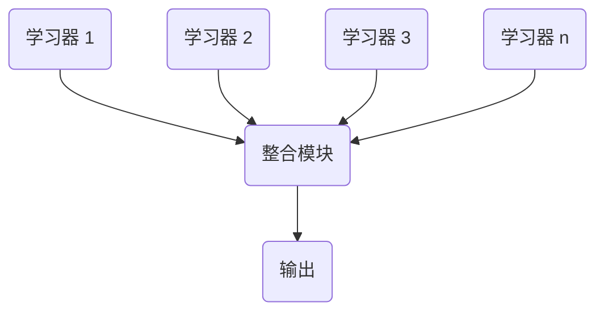
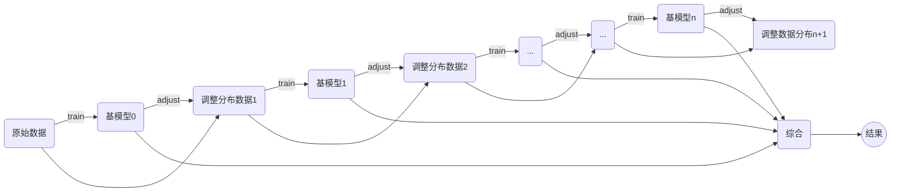

# Boosting 调研  

在我当前研究工作中，需要有效的整合多个模型，因为没有合适的方法整合。所以想要系统性的了解集成学习的相关知识和方法，因此该读书笔记将记录boosting方法的历史发展和经典方法。主要包括以下几个方面：  

1. [集成学习的简要介绍](#id0)  
2. [boosting方法概述](#id1)  
3. [Adaboost](#id2)  
4. [GBDT](#id3)  
5. [XGBoost](#id4)  

   

## 1. 集成学习的简要介绍  

### 1.1 什么是集成学习[^1]

[^1]:参考《机器学习》，周志华，清华大学出版社  
> 集成学习是通过构建并合并多个分类器来完成学习任务，有时也被称为多分类器系统(multi-classifier system)、基于委员会的学习(committee-based learning)等。下图显示了集成学习的一般结构：  

在集成学习中，先产生一组“个体学习器”(individual learner), 再用某种策略将它们结合起来。个体学习器通常有现有的学习算法从训练数据产生，例如决策树算法，BP神经网络网络等。若个体学习器都是相同的，比如所有的个体学习器都是“决策树”或者“BP神经网络”，则称这样的集成是“同质”的(homogeneous)。同质集成中的个体学习器也称“基学习器”（base learner), 相应的学习算法称之为“基学习算法”(base learning algorithm)  
当然集成的学习器中也可以包含不同种类的个体学习器，比如同时包含“决策树”和“BP神经网络”，这样的集成称之为“异质”的(heterogenous)。由于异质学习器的个体学习器不同，所以个体学习器由不同的学习算法生成，此时就没有统一的基学习算法。相应的，个体学习器不再称之为基学习器而是被称之为“组件学习器”(component learner)或直接称之为个体学习器。  
集成学习器通过将多个学习器进行结合，通常可以获得比单一学习器显著优越的泛化性能。集成尤其对“弱学习器”(weak learner)尤为明显，因此很多集成学习的研究都是针对弱学习器进行的，于是有时基学习器也被称做弱学习器。虽然从理论上来说，集成足够的弱学习器足以获得很好的性能，但在实践中考虑到使用的学习器的个数等种种因素，人们往往会使用较强的学习器。  

### 1.2 集成学习的分类  
按照集成目的分类，一般可以划分为Bagging(bootstrap aggregation),boosting以及stacking。
> *Bagging* 对数据集进行重采样，每个数据点被等概率采样，然后创建n个模型。其中每个模型均由m个采样数据得到,最终采用投票的方式得到最后的结果。  

* Bagging能够降低variance，改善模型的泛化误差。
* 性能依赖于基分类器的稳定性；若基分类器不稳定，则bagging有助于降低随机误差；若个体分类器稳定，则集成分类器的误差主要由基分类器的偏差引起。
* 由于每个样本被选中的概率相同，所以bagging不侧重于训练数据集中的任何实例。

> **boosting** 是一族可以将弱学习器提升为强学习器的算法。这种方法首先在初始训练集上训练得到一个基分类器，然后根据基分类器的表现调整数据分布，使得先前在基分类器上表现效果比较差的样本在后续受到更多的关注。再在调整分布后的数据上训练新的基分类器，不断迭代直至达到预先设定的基分类器的个数。可以用下列流程图示意这个过程：  

* boosting主要关注降低偏差，因此其可以基于泛化性能相当弱的分类器构建出很强的集成模型。

* **每一轮训练过程中如何改变数据的权值或概率分布？**

* **通过什么方式组合弱分类器？**

> **stacking** 先从初始数据集中训练出初级学习器，然后“生成”一个新数据集用于训练次级学习器。在训练次级学习器的过程中，将初级学习器的输出作为次级学习器的输入(例如：n个初级学习器的预测结果所组成的向量作为次级学习器的输入)而依旧将初始数据集的标签作为次级学习器的标签。初级学习器可以是异质的，意味着初级学习器可以使用各种各样的模型实现。

  

## 2. boosting方法概述[^2]  

[^2]:https://en.wikipedia.org/wiki/Boosting_(machine_learning)
### 2.1 boosting 历史
在机器学习领域中，boosting将很多meta-algorithm组合起来以实现减小bias的目的。其也是一族将弱学习器转化为强学习器的方法。Boosting主要基于Kearns和Valiant(1988, 1989)提出的问题：“一组弱学习器能否创造一个强学习器？”。 弱学习器被定义为只与正确类别稍微相关的分类器（比随机猜测稍好）。相比之下，强学习器被定义为与正确类别任意相关的分类器。  
Robert Schapire在1990年的一篇论文[^3]中对Kearns和Valiant的问题进行了肯定回答，对机器学习和统计学产生了重大影响，最显著的是促进了boosting的发展。

### 2.2 boosting 算法[^4]
[^4]:https://baike.baidu.com/item/Boosting/1403912?fr=aladdin

#### 2.2.1算法起源
V1990年, Schapire最先构造出一种多项式级的算法 ,对该问题做了肯定的证明 ,这就是最初的 Boosting算法。一年后 ,Freund提出了一种效率更高的Boosting算法。但是,这两种算法存在共同的实践上的缺陷 ,那就是都要求事先知道弱学习算法学习正确的下限。1995年 , Freund和 schap ire改进了Boosting算法 ,提出了 AdaBoost (Adap tive Boosting)算法[ 5 ],该算法效率和 Freund于 1991年提出的 Boosting算法几乎相同 ,但不需要任何关于弱学习器的先验知识 ,因而更容易应用到实际问题当中。之后 , Freund和 schapire进一步提出了改变 Boosting投票权重的 AdaBoost . M1,AdaBoost . M2等算法 ,在机器学习领域受到了极大的关注。  
#### 2.2.2算法概述  
Boosting是一种框架算法,主要是通过对样本集的操作获得样本子集,然后用弱分类算法在样本子集上训练生成一系列的基分类器。他可以用来提高其他弱分类算法的识别率,也就是将其他的弱分类算法作为基分类算法放于Boosting 框架中,通过Boosting框架对训练样本集的操作,得到不同的训练样本子集,用该样本子集去训练生成基分类器;每得到一个样本集就用该基分类算法在该样本集上产生一个基分类器,这样在给定训练轮数 n 后,就可产生 n 个基分类器,然后Boosting框架算法将这 n个基分类器进行加权融合,产生一个最后的结果分类器,在这 n个基分类器中,每个单个的分类器的识别率不一定很高,但他们联合后的结果有很高的识别率,这样便提高了该弱分类算法的识别率。在产生单个的基分类器时可用相同的分类算法,也可用不同的分类算法,这些算法一般是不稳定的弱分类算法,如神经网络(BP) ,决策树(C4.5)等。  
#### 2.2.3基本算法
由于Boosting算法在解决实际问题时有一个重大的缺陷,即他们都要求事先知道弱分类算法分类正确率的下限,这在实际问题中很难做到。后来 Freund 和 Schapire提出了 AdaBoost 算法,该算法的效率与 Freund 方法的效率几乎一样,却可以非常容易地应用到实际问题中。AdaBoost 是Boosting 算法家族中代表算法,AdaBoost 主要是在整个训练集上维护一个分布权值向量 Dt( x) ,用赋予权重的训练集通过弱分类算法产生分类假设 Ht ( x) ,即基分类器,然后计算他的错误率,用得到的错误率去更新分布权值向量 Dt( x) ,对错误分类的样本分配更大的权值,正确分类的样本赋予更小的权值。每次更新后用相同的弱分类算法产生新的分类假设,这些分类假设的序列构成多分类器。对这些多分类器用加权的方法进行联合,最后得到决策结果。这种方法不要求产生的单个分类器有高的识别率,即不要求寻找识别率很高的基分类算法,只要产生的基分类器的识别率大于 0.5 ,就可作为该多分类器序列中的一员。  
寻找多个识别率不是很高的弱分类算法比寻找一个识别率很高的强分类算法要容易得多,AdaBoost 算法的任务就是完成将容易找到的识别率不高的弱分类算法提升为识别率很高的强分类算法,这也是 AdaBoost 算法的核心指导思想所在,如果算法完成了这个任务,那么在分类时,只要找到一个比随机猜测略好的弱分类算法,就可以将其提升为强分类算法,而不必直接去找通常情况下很难获得的强分类算法。通过产生多分类器最后联合的方法提升弱分类算法,让他变为强的分类算法,也就是给定一个弱的学习算法和训练集,在训练集的不同子集上,多次调用弱学习算法,最终按加权方式联合多次弱学习算法的预测结果得到最终学习结果。
常见的算法还有GBDT以及XGBoost等，后面将详细介绍。

## 3. Adaboos

## 4. GBDT  

## 5. XGBoost
[^3]: Schapire, R. E. (1990). The strength of weak learnability. Machine learning, 5(2), 197-227.